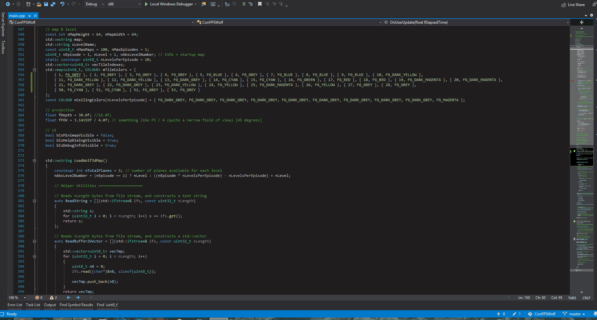

# Console Wolfenstein 3d

Simple ASCII renderer for Wolfenstein 3d maps/levels.

## Getting Started

### Dependencies

* olcConsoleGameEngine (included in the source)
* Visual Studio 2019
* Wolfenstein 3d Shareware (included)

### Installing

* Visual Studio 2019, project. Open the IDE and start coding.

### Instructions

* H = TOGGLE HELP DIALOG
* ASDFW = MOVEMENT
* M = MINIMAP
* I = DEBUG INFO
* N = NEXT LEVEL
* P = PREVIOUS LEVEL

## Authors

Vitor Almeida da Silva  
[@vitoralmeidasil](https://twitter.com/vitoralmeidasil)

## Acknowledgments

[@javidx9](https://twitter.com/javidx9) For developing the awesome olcConsoleGameEngine used as a base for the renderer.

* [OneLoneCoder](https://github.com/OneLoneCoder)
* [CommandLineFPS](https://github.com/OneLoneCoder/CommandLineFPS)
